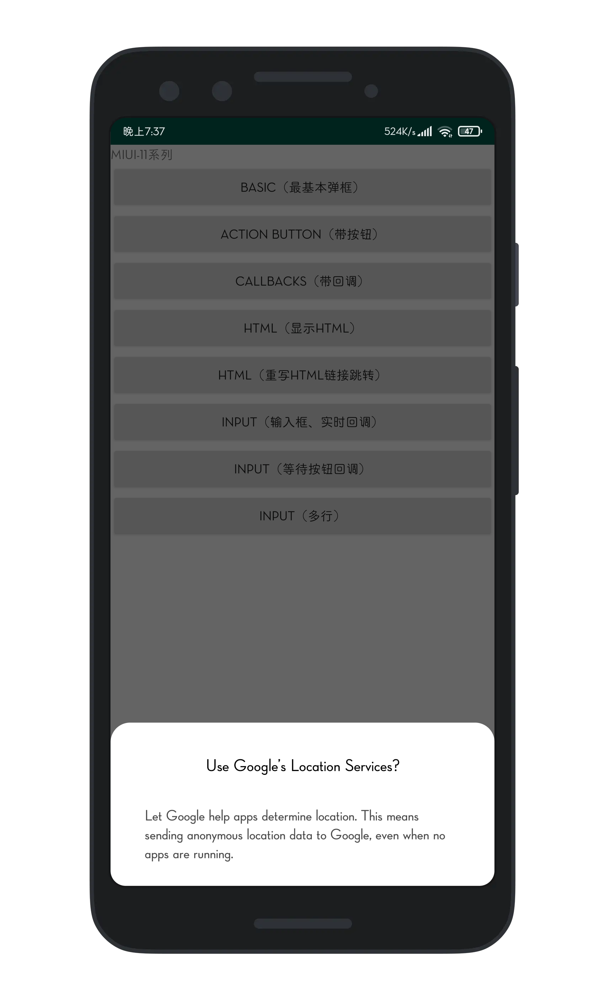
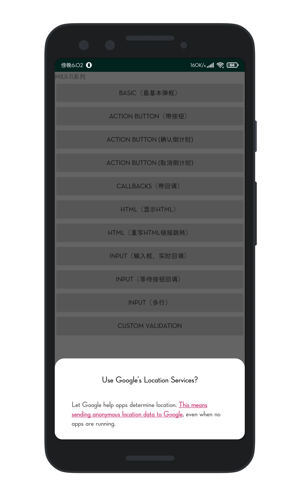
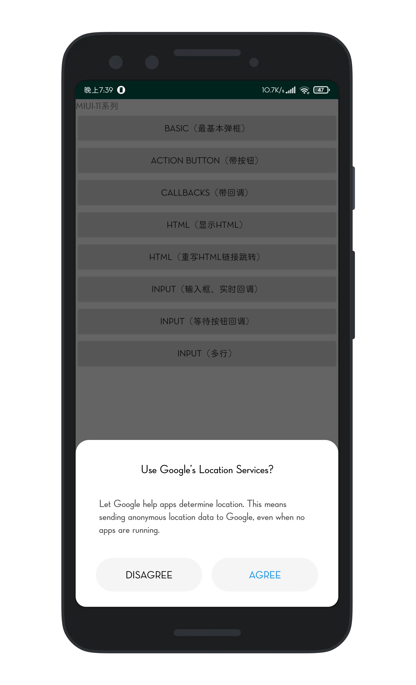
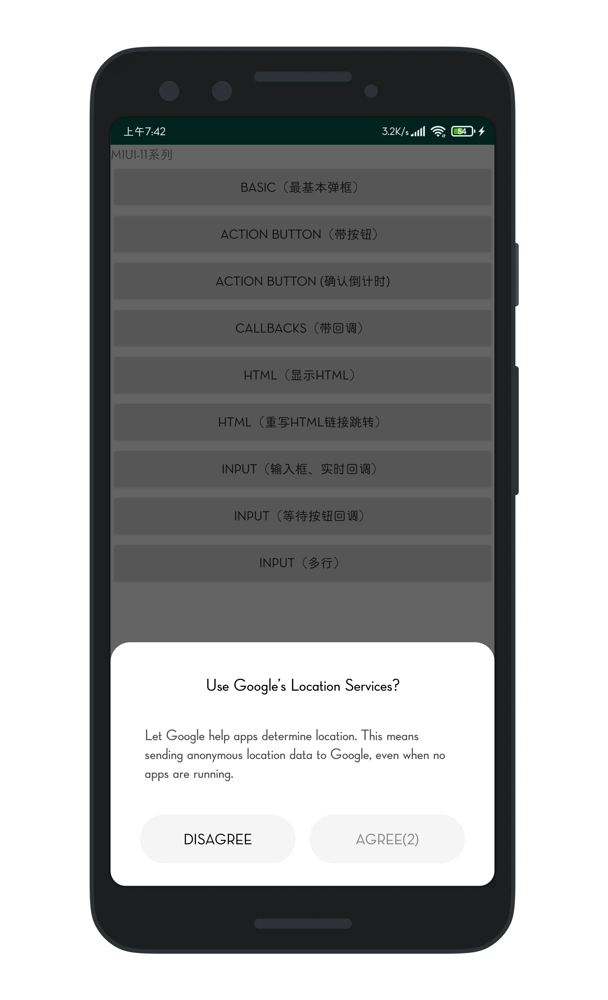
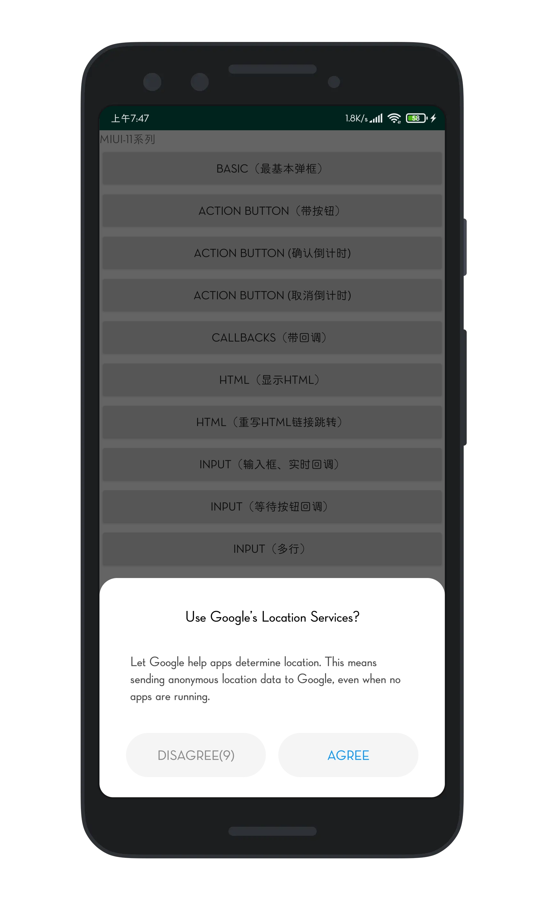
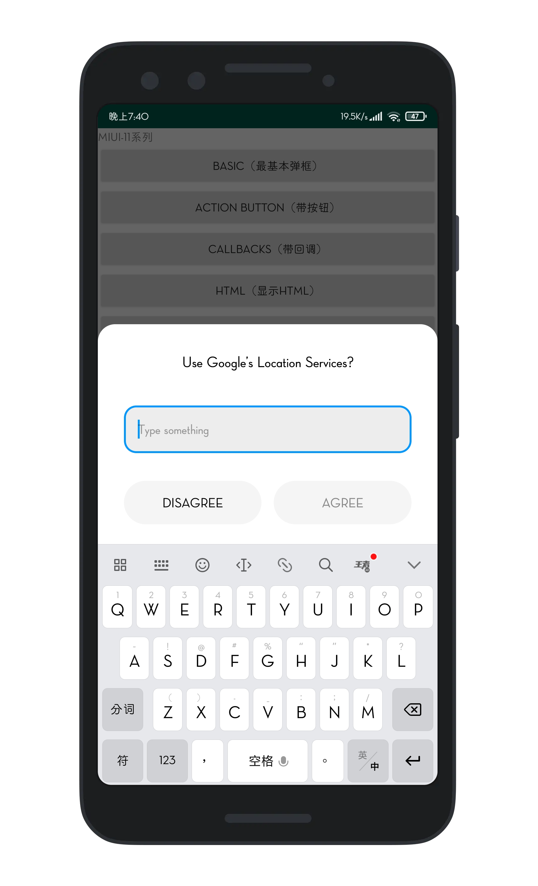
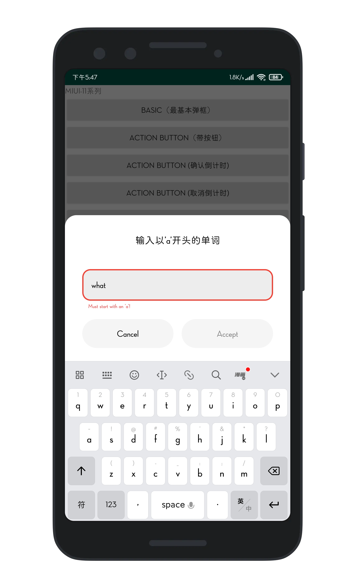

# MIUI-like Dialog

  

> based on [material-dialogs](https://github.com/afollestad/material-dialogs)

入坑这个系列不是为了在MIUI系统上使用特定的(MIUI-dialog)弹窗,而是为了保证App弹窗适配App的UI(毕竟非Material Design的App用系统或者material-dialogs的弹窗总是感觉不搭)

## Table of Contents

1. [Gradle Dependency](#Gradle-Dependency)
2. [Basics](#Basics)
3. [Customizing the Message](#Customizing-the-Message)
4. [Action Button](#Action-Button)
5. [CountDown](#CountDown)
6. [Adding an Icon](#Adding-an-Icon)
7. [Text Input](#text-input)
    1. [Basics](#input-basics)
    2. [Hints and Prefill](#hints-and-prefill)
    3. [Input Types](#input-types)
    4. [MultiLines](#input-multilines)
    5. [Custom Validation](#custom-validation)
8. [Callbacks](#Callbacks)
9. [Dismissing](#Dismissing)
    
## Gradle Dependency
Add it in your root build.gradle at the end of repositories:
```
allprojects {
    repositories {
        ...
        maven { url 'https://jitpack.io' }
    }
}
```
*Step 2.* Add the dependency

```
implementation 'com.github.PPeanutButter:miui-dialogs:@jitpack_version'
```

## Basics

Here's a very basic example of creating and showing a dialog:



```kotlin
MIUIDialog(this).show {
    title(R.string.your_title)
    message(R.string.your_message)
}
```

`this` should be a `Context` which is attached to a window, like an `Activity`.

If you wanted to pass in literal strings instead of string resources:

```kotlin
MIUIDialog(this).show {
    title(text = "Use Google\'s Location Services?")
    message(text = "Let Google help apps determine location. This means sending anonymous location data to Google, even when no apps are running.")
}
```

Note that you can setup a dialog without immediately showing it, as well:

```kotlin
val dialog = MIUIDialog(this)
    .title(R.string.your_title)
    .message(R.string.your_message)
dialog.show()
```

## Customizing the Message

The `message` function lets you trail it with a lambda, which exposes certain built-in modifiers along with allowing you to act on the `TextView` directly.



```kotlin
MIUIDialog(this).show {
  message(R.string.your_message) {
      html() // format, color, etc. with tags in string
      html { link ->  // same as above, but... 
        // Invokes a callback when a URL is clicked instead of auto opening it in a browser
      }
      lineSpacing(1.4f) // modifies line spacing, default is 1.0f
      
      // You can directly act on the message TextView as well
      val textView = messageTextView
  }
}
```
## Action Button

There are simple methods for adding action buttons:



```kotlin
MIUIDialog(this).show {
  positiveButton(R.string.agree)
  negativeButton(R.string.disagree)
}
```

You can use literal strings here as well:

```kotlin
MIUIDialog(this).show {
  positiveButton(text = "Agree")
  negativeButton(text = "Disagree")
}
```

---

Listening for clicks on the buttons is as simple as adding a lambda to the end:

```kotlin
MIUIDialog(this).show {
    positiveButton(text = "Agree"){
        //do
    }
    negativeButton(text = "Disagree"){
        //do
    }
}
```

If action buttons together are too long to fit in the dialog's width, they will be automatically stacked:

not tested yet!

## CountDown

You can disable Positive Button in first few seconds(let user wait):



```kotlin
MIUIDialog(this).show {
    title(text = "Use Google\'s Location Services?")
    message(text = "Let Google help apps determine location. This means sending")
    positiveButton(text = "Agree",countdown = 5){
        "you clicked positive button!".toast(this@MainActivity3)
    }
    negativeButton(text = "Disagree"){
        "you clicked negative button!".toast(this@MainActivity3)
    }
}
```

---

You can also set run Negative Callback automatically when wait time-out:



```kotlin
MIUIDialog(this).show {
    title(text = "Use Google\'s Location Services?")
    message(text = "Let Google help apps determine location. This means sending a")
    positiveButton(text = "Agree"){
        "you clicked positive button!".toast(this@MainActivity3)
    }
    negativeButton(text = "Disagree",countdown = 10){
        "you clicked negative button!".toast(this@MainActivity3)
    }
}
```

## Adding an Icon

You can display an icon to the `Top` of the title:

not support yet!

## text input

### input Basics

You can setup an input dialog using the `input` extension on `MIUIDialog`:



```kotlin
MIUIDialog(this).show {
  input()
  positiveButton(R.string.submit)
}
```

With a setup input dialog, you can retrieve the input field:

```kotlin
val dialog: MIUIDialog = MIUIDialog(this).show{}
val inputField: EditText = dialog.inputField
```

---

You can append a lambda to receive a callback when the positive action button is pressed with 
text entered: 

```kotlin
MIUIDialog(this).show {
  input { dialog, text ->
      // Text submitted with the action button
  }
  positiveButton(R.string.submit)
}
```

If you set `waitForPositiveButton` to false, the callback is invoked every time the text field is
modified:

```kotlin
MIUIDialog(this).show {
  input(waitForPositiveButton = false) { dialog, text ->
      // Text changed
  }
  positiveButton(R.string.done)
}
```

To allow the positive action button to be pressed even when the input is empty:

```kotlin
MIUIDialog(this).show {
  input(allowEmpty = true) { dialog, text ->
      // Text submitted with the action button, might be an empty string`
  }
  positiveButton(R.string.done)
}
```

### Hints and Prefill

You can set a hint to the input field, which is the gray faded text shown when the field is empty:

```kotlin
MIUIDialog(this).show {
  input(hintRes = R.string.hint_text)
}
```

A literal string can be used as well:

```kotlin
MIUIDialog(this).show {
  input(hint = "Your Hint Text")
}
```

---

You can also prefill the input field:

```kotlin
MIUIDialog(this).show {
  input(prefillRes = R.string.prefill_text)
}
```

A literal string can be used as well:

```kotlin
MIUIDialog(this).show {
  input(prefill = "Prefilled text")
}
```

### Input Types

You can apply input types to the input field, which modifies the keyboard type when the field is 
focused on. This is just taken right from the Android framework, the input type gets applied 
directly to the underlying `EditText`:

```kotlin
val type = InputType.TYPE_CLASS_TEXT or 
  InputType.TYPE_TEXT_VARIATION_EMAIL_ADDRESS
  
MIUIDialog(this).show {
  input(inputType = type)
}
```

### input-multilines

By default, input lines is 1, you can set `multiLines = true` to activate multilines input when input content maght be large

```kotlin
MIUIDialog(this).show {
    title(text = "Use Google\'s Location Services?")
    input(hint = "Type something", multiLines = true){ charSequence, _ ->
        charSequence?.toString()?.toast(this@MainActivity3)
    }
    positiveButton(text = "Agree")
    negativeButton(text = "Disagree"){
        "You clicked negative button!".toast(this@MainActivity3)
    }
}
```

### Custom Validation

You can do custom validation using the input listener. This example enforces that the input starts with the letter 'a':



```kotlin
MIUIDialog(this).show {
  input(waitForPositiveButton = false) { dialog, text ->
    val inputField = dialog.getInputField()
    val isValid = text.startsWith("a", true)
    inputField?.error = if (isValid) null else "Must start with an 'a'!"
    dialog.setActionButtonEnabled(POSITIVE, isValid)
  }
  positiveButton(R.string.submit)
}
```

## Callbacks

There are a few lifecycle callbacks you can hook into:

```kotlin
MIUIDialog(this).show {
  onPreShow { dialog -> }
  onShow { dialog -> }
  onDismiss { dialog -> }
  onCancel { dialog -> }
}
```

## Dismissing

Dismissing a dialog closes it:

```kotlin
MIUIDialog(this).show {
    dismiss()
}
```

---

You can prevent a dialog from being canceled, meaning it has to be explictly dismissed with an action button or a call to the method above.

```kotlin
MIUIDialog(this).show {
  cancelable = false  // calls setCancelable on the underlying dialog
  cancelOnTouchOutside = false  // calls setCanceledOnTouchOutside on the underlying dialog
}
```

## Lists

not support yet!

## Checkbox Prompts

not support yet!

## Custom Views

not support yet!

## Miscellaneous

not support yet!

## Theming

Google's newer mindset with Material Theming (vs the 2014 mindset) is flexible. If you take their 
["Crane example"](https://material.io/design/components/dialogs.html#theming), you see that they 
change fonts, corner rounding, etc. 

### Light and Dark

Light and dark theming is automatic based on your app's theme (basically whether `android:textColorPrimary` 
is more light or more dark):


### Background Color

Material Dialogs uses the value of the `colorBackgroundFloating` attribute in your Activity theme 
for the background color of dialogs. You can also use the `md_background_color` attribute in your 
theme, which will take precedence.

### Ripple Color

Material Dialogs uses the value of the `?android:colorControlHighlight` attribute in your Activity 
theme for the ripple color of list items, buttons, etc. by default. You can override this with the 
`md_ripple_color` theme attribute as well.

### Corner Radius

Corner radius is the rounding of dialog corners:


it can be changed with an attribute in your app theme. It defaults to 4dp:

```xml
<style name="AppTheme.Custom" parent="Theme.AppCompat">

  <item name="md_corner_radius">16dp</item>
    
</style>
```

There is also a programmatic setter for this value:

```kotlin
MaterialDialog(this).show {
  // literal, internally converts to dp so 16dp
  cornerRadius(16f)
  // Using a dimen instead is encouraged as it's easier to have all instances changeable from one place
  cornerRadius(res = R.dimen.my_corner_radius)// (not support yet)
}
```

### Text Color (not support yet)

By default, `android:textColorPrimary` and `android:textColorSecondary` attributes from your Activity
theme are used for the title and content colors of dialogs. `colorPrimary` is used for the default 
text color of action buttons. If you wish to override these, there are attributes provided:

```xml
<style name="AppTheme.Custom" parent="Theme.AppCompat">

  <item name="md_color_title">@color/your_color</item>
  <item name="md_color_content">@color/your_color</item>
  <item name="md_color_button_text">@color/your/color</item>
    
</style>
```

### Fonts (not support yet)

This library supports using custom fonts, powered by the Support libraries `ResourcesCompat` class. 
With raw font files or XML font files in your `/res/font` folder, you can use them in Material Dialogs 
using attributes in your app's theme.

```xml
<style name="AppTheme.Custom" parent="Theme.AppCompat">

  <item name="md_font_title">@font/your_font</item>
  <item name="md_font_body">@font/your_font</item>
  <item name="md_font_button">@font/your_font</item>
    
</style>
```

See the "Custom Theme" example in the sample project (open the overflow menu for the theme switcher).

